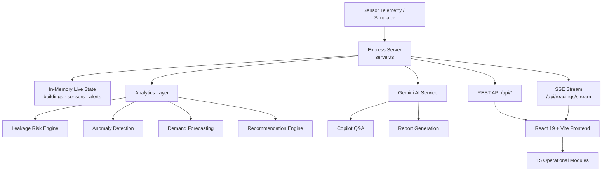

<div align="center">

# 💧 JalRakshak AI

### Predictive Water Intelligence & Loss Prevention Platform

**Predict Water Loss. Prevent Waste. Protect Tomorrow.**

[](https://jairakshakai.onrender.com)
[](https://react.dev)
[](https://www.typescriptlang.org)
[](https://ai.google.dev)
[](LICENSE)

### 🔗 [**Launch the Live Platform →**](https://jairakshakai.onrender.com)

`https://jairakshakai.onrender.com`

</div>

---

## 📌 Overview

**JalRakshak AI** is an end-to-end water intelligence platform that turns raw flow, pressure, tank, and quality telemetry into **early leak warnings, demand forecasts, and actionable conservation decisions**.

Instead of discovering a burst pipe from a shocking monthly bill, JalRakshak continuously watches inlet-vs-outlet balance, pressure behaviour, and consumption patterns across every building in a campus — then flags the anomaly, estimates the loss, ranks the fix, and schedules the maintenance.

The platform combines a **live digital twin**, an **anomaly & leakage detection engine**, **predictive maintenance**, **water-quality monitoring**, and a **Gemini-powered copilot** that answers operational questions in natural language and drafts sustainability reports.

---

## 🎯 The Problem

| Challenge | Consequence |
|---|---|
| Leaks stay invisible until the bill arrives | 20–40% of supplied water lost as Non-Revenue Water |
| Manual meter reading is periodic, not continuous | Faults run undetected for days or weeks |
| No demand forecasting | Over-pumping, tank overflow, wasted energy |
| Data is spread across buildings and sensors | No single operational picture for facility teams |
| Sustainability reporting is manual | Slow, inconsistent ESG and audit documentation |

---

## ✨ Core Capabilities

### 📊 Master Dashboard
Unified KPI view — today's consumption and delta vs yesterday, live flow rate, leakage risk %, active alerts, tank level, water-quality score, water saved, energy saved (kWh) and CO₂ avoided (kg).

### 📡 Real-Time Monitoring (SSE)
Server-Sent Events push telemetry to every connected client on a 3-second tick — flow (LPM), pressure (bar), tank level, inlet/outlet volume, consumption rate, pH, turbidity, TDS, temperature, and conductivity.

### 🧬 Digital Water Twin
A live virtual replica of the campus water network — zones, pipelines, buildings, and sensors — with state synchronized continuously to the incoming telemetry stream.

### 🚨 Anomaly & Leakage Detection Centre
Continuous inlet-vs-outlet reconciliation and pressure-signature analysis produce a **leakage risk score** with severity classification (`NORMAL → MEDIUM → HIGH → CRITICAL`) and localization down to the building.

### 📈 Forecasting & Optimization
Demand forecasting for pumping schedules and tank management, with optimization insights that prevent overflow and off-peak waste.

### 🧪 Water Quality Module
Tracks pH, turbidity (NTU), TDS (mg/L), conductivity (µS/cm) and temperature against a composite quality score, raising alerts on contamination-style deviations.

### 🛠️ Predictive Maintenance
Converts detected anomalies into ranked maintenance tasks, with creation, assignment, and completion tracking.

### 🎛️ Digital Twin Simulator
Inject failure scenarios on demand to validate detection logic and train operators:

| Mode | Simulated Condition |
|---|---|
| `NORMAL` | Healthy baseline operation |
| `LEAKAGE_RISK` | High flow + pressure drop → elevated leak probability |
| `HIGH_CONSUMPTION` | Abnormal demand surge |
| `PRESSURE_DROP` | Supply-side pressure failure |
| `TANK_OVERFLOW` | Tank filling past safe threshold |
| `LOW_TANK` | Critical depletion scenario |
| `WATER_QUALITY_ANOMALY` | Turbidity spike and pH deviation |
| `SENSOR_FAILURE` | Degraded sensor with reduced data quality |

### 🗺️ Geospatial & Multi-Building Comparison
Map-based view of the network plus side-by-side benchmarking of consumption and efficiency across buildings.

### 🤖 JalRakshak Copilot (Gemini)
A grounded conversational assistant that answers questions against live platform state — with a deterministic analytical fallback engine so the product still responds when no API key is configured.

### 🌱 Sustainability & Reporting
Conservation goals, achievement badges, AI-generated report drafts, and a full **audit log** of every operator action.

---

## 🏗️ Architecture



**Request flow:** telemetry tick → state update → analytics recomputation → SSE broadcast → React context update → live dashboard re-render.

---

## 🧰 Tech Stack

| Layer | Technology |
|---|---|
| **Frontend** | React 19, TypeScript, Vite 8, Tailwind CSS 4 |
| **UI / UX** | Lucide React icons, Motion (animations), Recharts (visualization) |
| **Backend** | Node.js, Express 4, TypeScript (`tsx` / `esbuild`) |
| **AI** | Google Gemini via `@google/genai` |
| **Realtime** | Server-Sent Events (SSE) |
| **State** | React Context (`AppContext`) |
| **Deployment** | Render (Node web service, `render.yaml`) |

---

## 🚀 Getting Started

### Prerequisites
- **Node.js 18+** (or Bun)
- A **Google Gemini API key** — [get one here](https://aistudio.google.com/apikey)

### Installation

```bash
# 1. Clone the repository
git clone https://github.com/sathi2305/JaiRakshakai.git
cd JaiRakshakai

# 2. Install dependencies
npm install          # or: bun install

# 3. Configure environment
cp .env.example .env
# then add your Gemini key to .env

# 4. Start the dev server
npm run dev
```

The app runs at **http://localhost:3000**

### Environment Variables

```env
GEMINI_API_KEY="your_gemini_api_key"
APP_URL="http://localhost:3000"
```

> 🔐 `.env` is gitignored — never commit API keys. If a key is ever exposed, rotate it immediately in Google AI Studio.

### Available Scripts

| Command | Description |
|---|---|
| `npm run dev` | Start dev server with Vite middleware + HMR |
| `npm run build` | Build client (Vite) and bundle server (esbuild) |
| `npm start` | Run the production build |
| `npm run lint` | Type-check with `tsc --noEmit` |
| `npm run clean` | Remove build artifacts |

---

## 🔌 API Reference

**Base URL:** `https://jairakshakai.onrender.com/api`

### System
| Method | Endpoint | Description |
|---|---|---|
| `GET` | `/health` | Service status, version, simulation mode, connected clients |
| `GET` | `/audit` | Full operator audit log |

### Telemetry & Assets
| Method | Endpoint | Description |
|---|---|---|
| `GET` | `/dashboard/summary` | Aggregated KPI payload |
| `GET` | `/campuses` | Campus registry |
| `GET` | `/buildings` | All buildings with live metrics |
| `GET` | `/buildings/:id` | Detail for a single building |
| `GET` | `/sensors` | Sensor inventory and health |
| `GET` | `/readings/latest` | Most recent telemetry snapshot |
| `GET` | `/readings/history` | Historical readings series |
| `GET` | `/readings/stream` | **SSE** live telemetry stream |

### Intelligence
| Method | Endpoint | Description |
|---|---|---|
| `GET` | `/anomalies` | Detected anomalies with severity |
| `GET` | `/leakage-risk` | Leak probability and localization |
| `GET` | `/forecast` | Demand forecast series |
| `GET` | `/recommendations` | Ranked conservation actions |
| `POST` | `/recommendations/:id/apply` | Apply a recommendation |
| `GET` | `/water-quality` | Water quality parameters and score |
| `GET` | `/sustainability` | Goals, badges, and progress |

### Operations
| Method | Endpoint | Description |
|---|---|---|
| `GET` | `/alerts` | Active and historical alerts |
| `POST` | `/alerts/:id/acknowledge` | Acknowledge an alert |
| `POST` | `/alerts/:id/resolve` | Resolve an alert |
| `GET` | `/maintenance` | Maintenance task queue |
| `POST` | `/maintenance` | Create a maintenance task |

### Simulation & AI
| Method | Endpoint | Description |
|---|---|---|
| `POST` | `/simulator/mode` | Switch the active simulation mode |
| `POST` | `/simulator/inject` | Inject a one-off fault event |
| `POST` | `/simulations/run` | Run a what-if scenario |
| `POST` | `/reports/generate` | AI-generated report draft |
| `POST` | `/copilot` | Ask the JalRakshak Copilot |

---

## 🗂️ Project Structure

```
JaiRakshakai/
├── server.ts                    # Express API, SSE engine, Gemini integration
├── render.yaml                  # Render deployment blueprint
├── vite.config.ts               # Vite + React + Tailwind config
├── index.html                   # App shell
├── .env.example                 # Environment template
└── src/
    ├── main.tsx                 # React entry point
    ├── App.tsx                  # Root layout & view router
    ├── types.ts                 # Shared TypeScript types
    ├── context/AppContext.tsx   # Global state provider
    ├── data/mockDatabase.ts     # Seed campuses, sensors, pipelines, goals
    └── components/
        ├── common/              # Header, Sidebar
        ├── dashboard/           # Master dashboard
        ├── monitoring/          # Real-time telemetry
        ├── digitaltwin/         # Digital water twin
        ├── anomaly/             # Anomaly & leakage centre
        ├── forecast/            # Forecasting & optimization
        ├── recommendations/     # Conservation actions
        ├── simulator/           # Scenario simulator + drawer
        ├── maintenance/         # Predictive maintenance
        ├── quality/             # Water quality module
        ├── geospatial/          # Map view
        ├── comparison/          # Multi-building benchmarking
        ├── sustainability/      # Goals & badges
        ├── reports/             # Report centre
        ├── sensors/             # Sensor health
        ├── audit/               # Audit log
        └── copilot/             # Gemini copilot
```

---

## ☁️ Deployment

Deployed on **Render** using the included `render.yaml` blueprint.

| Setting | Value |
|---|---|
| **Environment** | Node |
| **Build Command** | `npm install && npm run build` |
| **Start Command** | `npm start` |
| **Environment Variables** | `NODE_ENV=production`, `PORT=3000`, `GEMINI_API_KEY` (secret) |

**Live URL:** https://jairakshakai.onrender.com

> 💤 Free/starter Render instances sleep when idle — the first request after inactivity may take 30–60 seconds to wake the service.

---

## 🗺️ Roadmap

- [ ] Persistent database layer (PostgreSQL / TimescaleDB) replacing in-memory state
- [ ] Live IoT ingestion via MQTT from physical flow and pressure sensors
- [ ] ML-based leak classification trained on historical incident data
- [ ] SMS / WhatsApp alerting for field maintenance crews
- [ ] Role-based authentication for operators, auditors, and administrators
- [ ] PDF export for sustainability and compliance reports
- [ ] Multilingual interface for regional deployment
- [ ] Mobile companion app for field technicians

---

## 🤝 Contributing

```bash
# Fork, then:
git checkout -b feature/your-feature-name
git commit -m "Add: clear description of your change"
git push origin feature/your-feature-name
# Open a Pull Request
```

Keep PRs focused, run `npm run lint` before submitting, and document any new API endpoint in the table above.

---

## 📄 License

Distributed under the MIT License. See [`LICENSE`](LICENSE) for details.

---

## 👤 Author

**Sathiyamoorthi**

[](https://github.com/sathi2305)

---

<div align="center">

### ⭐ If this project helps you, consider starring the repository.

**[💧 Try the Live Platform](https://jairakshakai.onrender.com)**

*Every drop measured is a drop saved.*

</div>
